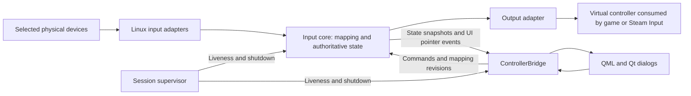

# Linux Gaming Technical Proposal

**Status:** Proposed design. This document does not implement or announce these capabilities.
**Date:** 2026-09-11
**Scope:** A separate platform track. Windows remains the host Nimbus targets and ships on; nothing here changes that, and nothing here gates a Windows release.
**Primary platform within this track:** Linux with an X11 desktop session.
**Baseline:** Local documentation branch at `df6da21`; Linux implementation reviewed in [PR #3](https://github.com/owenpkent/Nimbus-Adaptive-Controller/pull/3), commit `8a4114e`, still open when this proposal was written.
**Related work:** [Linux Probe Plan](LINUX_PROBE_PLAN.md), [Host Mode and Input Isolation](HOST_MODE_ISOLATION.md), [Hardware Integration](HARDWARE_INTEGRATION.md), [Keyboard Output](KEYBOARD_OUTPUT.md).

**Optional VM research:** [Virtual Machine Feasibility](VIRTUAL_MACHINE_FEASIBILITY.md) asks whether a guest VM buys anything on the Windows host, and concludes it does not. Its KVM/QEMU, VFIO and Looking Glass material describes a Linux host and belongs with this track if it is ever pursued. It does not gate anything in this proposal.

## 1. Decision and intended result

Develop Nimbus into a dependable adaptive gaming controller for X11. A player should select a game and control profile, start a session, use the panel beside or above the game, and return to the desktop without losing control of their input devices.

The first supported release targets the existing X11 environment used for the Linux work. A second X11 window manager must pass the acceptance suite before claiming broad X11 support. Record exact distribution, window manager, GPU driver, kernel, Qt, Steam, and Proton versions with each result.

Wayland is a deferred extension. Layer-shell integration, GNOME Wayland extensions, and Steam Deck Gaming Mode are not prerequisites for the X11 release. Running Qt through `xcb` inside a Wayland session is XWayland, not proof that the full X11 desktop contract works. Detect the session and verify window behavior instead of equating a Qt plugin name with support.

The release should provide:

- Reliable virtual Xbox and generic joystick output, with one active controller identity per session.
- Explicit selection of the physical devices Nimbus will capture.
- A reachable gameplay panel, dependable release controls, and usable settings dialogs.
- Predictable behavior on device loss, application failure, output changes, and suspend/resume.
- Per-game settings that reproduce a tested configuration.
- Local diagnostics and repeatable tests that distinguish input failures from game compatibility problems.

Graphics-driver tuning, kernel replacement, anti-cheat workarounds, and a general game launcher are outside this proposal. Gamescope is optional and must earn its place through measured results.

## 2. Baseline and evidence

The current checkout and PR #3 describe different stages of Linux support. Implementation must reconcile them deliberately.

| Area | Evidence available | Consequence for this proposal |
|---|---|---|
| Existing Xbox output | Checkout documentation records Linux output through vgamepad/libevdev and a Steam/Proton game | Preserve a working fallback while selecting the production backend |
| PR #3 output | Adds direct uinput Xbox and generic joystick devices | Use its public interface contract as the candidate baseline; do not maintain two simultaneously active Xbox backends |
| PR #3 isolation and window behavior | PR author reports successful X11 and in-game probes | Reproduce on release hardware; author measurements are not independent review results |
| Independent review | Synthetic reports, mocked devices, and real offscreen Qt widgets reproduced five defects | Fix these before expanding the capture architecture |
| Kernel/game verification during review | `/dev/uinput` and `/dev/input` were unavailable | No independent hardware, live X11, or anti-cheat acceptance claim follows from that review |
| Wayland | No completed acceptance evidence in the reviewed baseline | Deferred and reported as experimental |

The [detailed PR review](https://github.com/owenpkent/Nimbus-Adaptive-Controller/pull/3#pullrequestreview-5184483286) supplies the immediate work queue:

| Defect | Required regression check |
|---|---|
| Pulse restores stale stick state after a user release | Force the release between snapshot and restore; final output remains neutral |
| Absolute touchpad movement disappears after capture | Unsupported devices are rejected before capture, or a validated touchpad adapter produces motion |
| Synthetic events miss modal dialogs | Operate and dismiss an actual settings dialog while isolation is active |
| Output switching leaves the pulse attached to a destroyed device | Switch Xbox to joystick to Xbox; controller-mode state and device ownership agree |
| Failed capture leaks a pass-through keyboard | Fail the grab after keyboard creation; all resources close exactly once |

Before integration, retain the checkout's handling of `pyvjoy` raising `SystemExit` on unsupported hosts. Broadening an exception guard to `Exception` alone does not preserve that behavior.

## 3. Runtime contracts

These contracts apply to every implementation phase:

1. One component owns each captured descriptor and each virtual output device. Ownership transfer is explicit, including error paths.
2. User-requested controller state is authoritative. Pulses, previews, and diagnostics cannot overwrite it.
3. Stop discards pending gameplay commands, releases held outputs, and releases capture. Repeating Stop has no additional effect.
4. A new session cannot consume commands or callbacks from an earlier session.
5. Capture success means every required device in the selected group is captured and usable. A skipped device cannot silently count as isolated.
6. Relative input is conserved until consumed. Button edges retain order. Queue overload stops the session instead of silently losing releases.
7. A device reconnect, desktop unlock, or resume does not automatically restart gameplay or recapture a newly discovered device.
8. Opening settings cannot leave a modal window that the player's selected input cannot operate.
9. Output calibration is applied once. Driver adapters only translate normalized state to platform values.
10. Linux runtime work preserves the Windows public bridge API and existing profile identifiers.

## 4. Architecture and migration

### 4.1 Stabilization architecture

First stabilize the PR's existing bridge, capture reader, and output interfaces. Add a `GameSession` owner behind `ControllerBridge` to coordinate start, stop, output selection, and recovery. Do not make a process rewrite a dependency of correcting the five review findings.

The bridge remains the only QML-facing controller object. Extract lifecycle code from the growing bridge into testable modules, retaining its slots and signals as adapters. Linux imports continue to degrade gracefully when dependencies or permissions are missing.

### 4.2 Target architecture for responsive gameplay

Once the stabilized preview has a measured baseline, move continuous input processing into a dedicated core process. UI gestures send commands to the same core used by physical-device mappings. The QML event loop still handles ordinary widget interaction, but continuous locked-stick control no longer requires a synthetic mouse event to pass through QML for every delta.



The core owns device descriptors, input parsing, mapping state, and output writes. The UI owns rendering, window management, profile editing, and pointer delivery to Qt. A small supervisor owns process lifetime and observes both processes. It holds no input descriptors, so terminating the core can release its devices without a surviving duplicate descriptor keeping a grab alive.

This introduces a deliberate architectural change to the current convention that curves live in the bridge. Extract pure mapping functions from the bridge/configuration layer into a shared module, then call that module from the core. Keep the bridge as the command boundary. Move QML preview calculations to shared sampled curve data, or verify numerical parity while they are migrated. Update `CLAUDE.md`, the architecture overview, and the integration guide in the implementation PR that changes ownership.

### 4.3 Proposed module boundaries

Paths below are proposals, not existing files.

| Module | Responsibility |
|---|---|
| `src/game_session.py` | Session state machine, capability checks, output transition policy |
| `src/input_core/state.py` | Immutable frames, source ownership, sequence numbers, generation IDs |
| `src/input_core/mapping.py` | Curves, deadzones, relative-stick integration, button arbitration |
| `src/input_core/runtime.py` | Core event loop, scheduling, output submission |
| `src/input_core/protocol.py` | Versioned commands, snapshots, validation and bounded queues |
| `src/linux_input/discovery.py` | udev identity, capabilities, grouping, hotplug notifications |
| `src/linux_input/evdev_reader.py` | Relative mouse, switches, keyboard and controller event handling |
| `src/linux_input/libinput_reader.py` | Optional touchpad and tablet interpretation |
| `src/linux_input/capture.py` | Transactional acquisition, pass-through ownership, release |
| `src/linux_session/x11_windows.py` | Focus, geometry, stacking and display-change handling |
| `src/linux_session/supervisor.py` | Process launch, heartbeats and bounded failure recovery |
| `src/linux_session/diagnostics.py` | Capability report and explicitly initiated probes |

Keep the PR's `uinput_interface.py` as the initial output adapter. Evaluate libevdev if maintaining ioctl code becomes a reliability burden; the kernel documentation recommends considering it for new software. Changing libraries is a separate decision from fixing ownership and state semantics. [Kernel uinput documentation](https://docs.kernel.org/input/uinput.html)

### 4.4 Command and state protocol

Use inherited Unix sockets between processes, with no network listener. Start with length-prefixed JSON messages capped at 64 KiB and a versioned schema. Bulk diagnostic data stays outside the command channel. Benchmark before replacing JSON with a binary format.

Every command contains `protocol_version`, `session_id`, `generation`, `sequence`, `kind`, and a validated payload. Proposed kinds include `PrepareSession`, `Arm`, `Stop`, `SetControl`, `PointerFrame`, `ApplyMapping`, and `Heartbeat`. Replies contain acknowledgements, capability results, or structured failure reasons.

`Stop` and liveness use a separate bounded control channel so motion traffic cannot delay them. After accepting Stop, the core invalidates that generation before processing further gameplay messages. Out-of-order or previous-generation commands are rejected. A restart creates a new session ID and does not replay old state.

Controller state contains sticks, triggers, buttons, source ownership, and the applied mapping revision. The UI receives coalesced state snapshots at a maximum of 60 Hz. Absolute control updates may replace older unconsumed values for the same source and control. Relative deltas must be summed, never replaced. Press/release pairs and pointer-button ordering cannot be coalesced away. Any bounded queue overflow ends the session with an explicit reason.

## 5. Input capture and device support

### 5.1 Discovery and explicit selection

Replace `mouseN`-handler discovery with capability-based enumeration. Use udev monitoring for add/remove events and keep current event-node paths as runtime details. Persist a local identity made from serial information where available, physical path, device IDs, and interface capabilities. If two devices cannot be distinguished, ask the player to identify one through an intentional input action during setup.

Group related nodes using their physical parent and interface identity. Do not group solely by display name, and do not assume every node under a wireless receiver belongs to the same physical device. Show the nodes selected for capture in diagnostics; normal UI can show one friendly device label.

Offer two explicit policies:

- **Selected devices:** capture the player's chosen devices. Other pointers remain available, including an optional caregiver mouse. These uncaptured devices can still reach the game.
- **All configured pointers:** require capture of the complete configured pointer set. New or missing pointers invalidate readiness until reviewed. This does not imply that hidraw, direct USB, or every possible input access path is hidden.

Exclude Nimbus-created devices using a runtime registry of their sysfs identities. Names and vendor/product IDs alone are insufficient, especially when a virtual Xbox pad intentionally resembles physical hardware. This also prevents re-ingesting pass-through keyboard output.

### 5.2 Capture transaction

Start capture only after output creation, mapping validation, and release-control checks succeed:

1. Resolve selected identities and inspect every required interface.
2. Open descriptors and validate supported capabilities without grabbing.
3. Build required keyboard pass-through devices and wait for bounded readiness checks.
4. Verify that keys and mouse buttons that would cross the handoff are released. If held, remain in Preparing and show what must be released.
5. Acquire all required grabs, recheck held state, and roll back if the handoff was not neutral.
6. Initialize source state and publish capture readiness for the current generation.
7. Arm gameplay only after both core and UI acknowledge that generation.

No physical state snapshot and grab operation is globally atomic. Test press/release races at the boundary; if they cannot be reconciled on a supported device, refuse that transition rather than risk stuck keys. Hold pass-through ownership in a local cleanup stack until acquisition commits. On failure, unwind in reverse order and report the device and operation that failed.

On a normal release, finish pass-through releases before destroying its keyboard. On emergency release, release the grab immediately even if keys are held. Test desktop modifier state across both paths; an emergency must not wait indefinitely for physical key-up.

### 5.3 Event semantics

Preserve input reports across reads. Treat `SYN_REPORT` as a frame boundary, handle high-resolution wheel input without double-counting its legacy equivalent, and keep button edges ordered relative to movement. On `SYN_DROPPED`, ignore events through the next report boundary and resynchronize queryable state. Relative motion lost in an overrun cannot be reconstructed; pause that mapping and require rearming instead of inventing displacement. [Kernel event protocol](https://docs.kernel.org/input/event-codes.html)

Configure and record an available monotonic event clock. If kernel event timestamps cannot be placed in the measurement clock domain, measure from userspace receipt and label that limitation. Dispatch promptly on descriptor readiness; a select timeout is an idle wake-up bound, not a required input delay.

Pass-through keyboards track held keys separately from mapped gameplay buttons. Define repeat behavior explicitly and validate it with the desktop, including modifiers held across stop. Never forward unsupported miscellaneous codes merely because the source emitted them.

### 5.4 Touchpads and adaptive hardware

The first release supports validated relative mice and rejects unsupported absolute pointers before capture. Touchpad support is a separately gated addition, not a claim inferred from successfully opening the device.

Prototype libinput with a path context limited to selected devices. Its restricted-open callback must return the same owned descriptor on which capture is managed; a separately opened grabbed descriptor would leave libinput's event reader unable to receive the intended stream. Validate ownership and callback lifetime in a focused integration test before adopting a Python binding or a small native adapter. Libinput supplies pointer-device interpretation but does not implement joystick support. [Libinput device scope](https://wayland.freedesktop.org/libinput/doc/latest/what-is-libinput.html), [context API](https://wayland.freedesktop.org/libinput/doc/latest/api/group__base.html)

Do not attach a competing raw reader to that descriptor. Combo-keyboard forwarding must consume the adapter's event stream and preserve required keyboard semantics. If the adapter cannot support a particular combination, reject it before capture.

Touchpad acceptance covers contact start/end, tap, click-and-drag, scrolling, palm rejection, multiple contacts, and integrated keyboard behavior. Tablet absolute positioning requires an explicit screen/control mapping. Standard gamepads and joystick-like adaptive devices use an evdev adapter with axis metadata and calibration. Product-specific support is listed only after testing actual hardware.

## 6. Controller mapping and output

### 6.1 One writer and complete frames

Represent user intent separately from transient output. Only the core writer submits device frames. A compatibility pulse, if enabled, derives an output frame from the latest user state and never writes its offsets into that state.

Introduce an internal `submit_frame()` contract that translates all changed axes/buttons and finishes with one report boundary. Existing `set_button`, stick, trigger, and `update_axis` methods remain compatibility adapters during migration. Explicit reset releases every owned button and restores backend-appropriate neutral values.

Track requested state separately from the last successfully submitted frame. Handle interrupted, partial and temporarily blocked writes without interleaving another frame. Retry within a bounded deadline; if output cannot recover, destroy the device and stop the session. A failed write must not advance the successful-output sequence or leave the UI reporting a healthy connection.

Preserve the PR's current contracts: Xbox has 14 mapped Nimbus buttons, signed sticks with positive Y up at the application boundary, and triggers from 0 to 1. The generic joystick has eight axes and currently maps 56 buttons. That count describes this implementation, not a universal Linux button limit. Validate imported profiles against the selected backend and identify unsupported mappings before gameplay.

### 6.2 Relative-stick behavior and calibration

Store calibration separately for UI cursor movement and gameplay mapping. Reusing desktop cursor acceleration for aiming can make a profile depend on unrelated desktop preferences.

Support explicit relative-stick modes:

- **Displacement:** deltas accumulate into bounded stick position; a recenter action or configured return policy restores neutral.
- **Velocity:** displacement over a measured time interval determines stick deflection; idle decay returns to neutral.
- **Direct axis:** calibrated physical axis position maps to the output axis.

Document axis inversion, gain, deadzone, saturation and recenter behavior for each mode. Use elapsed-time smoothing, for example `alpha = 1 - exp(-dt / tau)`, so changing update frequency does not silently change feel. Migrate an existing smoothing factor using its previous nominal interval and compare recorded traces before selecting a new default.

A per-game calibration flow should measure comfortable reach, fine movement, neutral drift, and maximum desired turn rate. Keep any compensation for an in-game deadzone distinct from hardware-noise rejection. Mouse-to-stick mapping remains subject to the game's stick response and maximum turn rate; do not promise native mouse equivalence.

### 6.3 Pulses, output identity and co-control

Default new isolated sessions to no keep-alive pulse. Starting a session emits neutral state, not an automatic A press or large stick burst. Offer a per-game compatibility option only after testing proves it useful; its amplitude, schedule, and observed side effects belong in the game record.

Keep the selected virtual controller alive and neutral between sessions when practical. Create it before launching games that enumerate controllers once. Mapping/profile changes that preserve its device shape do not recreate it. Changing output shape stops capture and pulses, neutralizes and destroys the old device, creates the replacement, and requires rearming. A game restart may be necessary and must be stated when observed.

Starting Game Mode on generic joystick output must not create an additional Xbox device solely for a pulse. Use isolation with the selected output, or offer an explicit output change before arming.

For multiple input sources, track contributions by source ID. Start with logical OR for button holds, so one source's release cannot cancel another's hold. Require an explicit priority or override policy for shared axes; do not silently add them. Losing a source clears its contribution and pauses the session. Caregiver takeover is a deliberate action with a visible state, not implicit input competition.

Keyboard/mouse output and rumble forwarding follow the controller release. Virtual keyboard/mouse input reaches the desktop input stack, not a specified game window; emission must pause outside an explicitly armed gameplay context. Exclude those virtual devices from capture and test feedback loops. For rumble, advertise force-feedback capabilities only after upload, playback, stop, and removal are implemented and tested. Optional visual feedback may mirror rumble intensity, but cannot infer a game's semantic events from intensity alone.

## 7. X11 panel, focus and pointer delivery

### 7.1 Window modes

Provide two modes of the same QML application:

| Mode | Window behavior | Input behavior |
|---|---|---|
| Edit | Normal activation, complete menus, profile editor and dialogs | Gameplay paused; ordinary desktop interaction is available |
| Play | Compact controls, persistent Stop, optional no-focus and pinning | Selected capture policy and current mapping are armed |

For Play, use Qt's X11 no-focus and always-on-top hints as the first implementation. Save geometry and prior flags before applying them. Restore only session-owned changes on exit, preserving explicit user preferences. Verify actual window stacking and focus after the window manager processes the requests; a successful Qt setter is not proof of the result. EWMH defines the relevant active-window, work-area and above-state properties, but window-manager policy still matters. [EWMH window properties](https://specifications.freedesktop.org/wm/latest/ar01s05.html)

Do not repeatedly force focus back to the game. Let the user Alt-Tab, stop, or open settings. If Play loses its required visibility or the game focus cannot be established, pause gameplay and explain the state. A recognized Nimbus settings dialog is an intentional transition, not an unexpected focus failure.

An X11 gamescope window is treated as a game presentation window. Nested gamescope gives the game a separate Xwayland display and configurable resolution; it does not establish that an external Nimbus panel will remain visible. Test focus, pinning and pointer behavior with and without gamescope before making it a game preset default. [Gamescope documentation](https://github.com/ValveSoftware/gamescope)

### 7.2 Positioning and display changes

Persist a display selection and normalized anchor/margins, not only absolute desktop coordinates. On startup or monitor removal, resolve the display, clamp the panel into its available geometry, and ensure Stop remains reachable. Respect Qt logical coordinates and per-screen scale; avoid applying a second device-pixel conversion to Qt mouse events.

Support top/bottom/left/right compact placement and a user-positioned panel. A reserved strip is a separate mode that requires a window-manager acceptance test. Do not turn Nimbus into a dock or promise that a fullscreen game will respect a desktop work-area reservation by default.

Test negative monitor origins, rotated monitors, mixed scaling, maximized windows, fullscreen transitions, desktop panels, and window-ID changes after flag updates. Offer an accessible reset-position action independent of the current panel location.

### 7.3 Software cursor and dialogs

Retain an application-local software cursor during capture. Do not send gameplay pointer movement through XTest or warp the desktop pointer on every report: those actions would reintroduce pointer events visible outside Nimbus.

Add an `IsolationEventRouter` owned by the bridge. Register the main QQuickWindow, Nimbus-owned popup windows, and QWidget dialogs. Before generating an event, choose the active modal target if present; otherwise use the appropriate registered surface. Map coordinates into that target and track press ownership so release reaches the surface that received the press, even if the pointer moves away.

Pointer delivery must include modifiers, extra mouse buttons, wheel precision, drag state, double-click timing, and cancellation when a target closes. Never route to unrelated top-level windows. Keep rendering and event coordinates in the same space and preserve report ordering through the relay queue.

As the first implementation, opening a legacy native settings dialog performs a controlled transition: pause gameplay and neutralize output, acknowledge release of capture, restore normal activation, then open the dialog. Closing it returns to Ready and requires an explicit Resume. Later routing support may retain capture inside fully supported Nimbus dialogs. If a platform file chooser cannot be registered and tested, use the controlled transition.

Switch between `ui_pointer` and `locked_control` routing through an acknowledged generation change. In `locked_control`, the core maps movement directly to the chosen joystick; the UI displays state. Returning to `ui_pointer` clears accumulated motion and requires held pointer buttons to be reconciled. This prevents the click used to unlock a control from accidentally activating a menu or game action.

## 8. Session state and recovery

### 8.1 State machine

| State | Meaning | Allowed transition |
|---|---|---|
| Idle | No active game session; output may exist at neutral | Prepare |
| Preparing | Validate mapping, devices, window and release paths | Ready or Idle with reason |
| Ready | Configuration valid; gameplay disarmed and capture released | Start or Edit |
| Capturing | Execute capture transaction; output stays neutral | Active or rollback to Ready |
| Active | Capture and output belong to the acknowledged session generation | Stop, Edit, output change or failure |
| Stopping | Invalidate commands, neutralize output, release capture and session window flags | Ready or Faulted |
| Faulted | Recovery completed as far as possible; gameplay disarmed | Revalidate explicitly |

On a stop request, cancel scheduled pulses and actions before neutralizing state. Release synthetic UI presses, pass-through keys, grabs and session-owned window flags. All cleanup is idempotent. A failure on one cleanup operation does not prevent attempting the rest. Publish an error if a step failed, rather than reporting a clean stop without evidence.

### 8.2 Failure policy

| Trigger | Required behavior |
|---|---|
| Selected device disconnect | Clear its contribution, neutralize gameplay, release remaining captures, await explicit revalidation |
| New device appears | Discover it without capture; invalidate an all-configured-pointers claim if its coverage is no longer complete |
| Suspend, session lock or seat deactivation | Disarm and release; resume/unlock returns to Ready, never Active |
| Game exits | End the associated session; leave the launcher/desktop usable |
| Output write failure | Stop, attempt neutralization, destroy output if necessary, show disconnected state |
| UI closes or its event loop stops responding | Core disarms; supervisor terminates an unresponsive core if release is not acknowledged |
| Core hangs or crashes | Supervisor ends the core process, invalidates the session and notifies the UI |
| Mapping or output change while active | Stop first; apply a validated revision; require rearming |
| Queue overflow or unrecoverable event loss | Disarm with a diagnostic reason |

Initial core-process design: UI and core publish progress heartbeats every 100 ms, generated by the event loops whose progress matters. Start with a 1-second liveness lease and a 2-second total recovery acceptance target under the specified stress workload. These are proposed test targets, not hard real-time guarantees. An idle player continues to generate healthy heartbeats; holding a button does not look like application failure.

The supervisor must be independent of Qt and the core interpreter. It requests Stop, then terminates only the owned core process if its bounded stop deadline expires. The core alone holds device descriptors. No process automatically restarts a captured session after failure. Test failure injection with `SIGSTOP`, process termination, closed sockets, and a blocked Qt event loop.

### 8.3 Release controls

Provide a large persistent Stop control and an independently processed emergency chord. Preserve `Ctrl+Alt+F12` as the initial default but allow an accessible switch/button binding. Evaluate X11 global key registration on an uncaptured keyboard; also detect the chord directly on captured combo devices because X11 cannot see their original events.

Emergency handling belongs to the input/session layer, not a QML callback. It must stop pulses and gameplay outputs as well as release the mouse. Resolve held keys across configured sources and clear state on device loss. A portal shortcut may be an additional integration where available, but is not the sole recovery mechanism. [Global Shortcuts portal](https://flatpak.github.io/xdg-desktop-portal/docs/doc-org.freedesktop.portal.GlobalShortcuts.html)

## 9. Game presets and configuration migration

### 9.1 Separate portable intent from machine details

Retain `ProjectNimbus`, existing profile IDs, and the `vigem`/`vjoy` compatibility values. Add a proposed versioned game-session preset beside existing profiles, rather than inserting Linux device paths into `custom_layout.widgets`.

| Data | Proposed storage | Export behavior |
|---|---|---|
| Layout and widget mappings | Existing profile JSON | Existing portable behavior |
| Game association and mapping overrides | `ProjectNimbus/game_presets/*.json` | Exportable after validation |
| Device identities, local game paths and display selection | `ProjectNimbus/linux_host.json` | Local only |
| Compatibility measurements | `docs/compatibility/linux/` for reviewed records; local reports for user tests | Explicit submission/export |
| Runtime socket/session identifiers | Private runtime directory or inherited descriptors | Never exported |

The following is a proposed schema example, not a configuration accepted by current code:

```json
{
  "schema_version": 1,
  "id": "example-game-x11",
  "game": {"kind": "steam", "app_id": "123456"},
  "profile_id": "adaptive_platform_2",
  "output_mode": "vigem",
  "capture": {"policy": "selected", "device_refs": ["player_pointer"]},
  "panel": {"mode": "compact", "anchor": "right", "pin": true},
  "compatibility": {"pulse": "off", "steam_input": "untested", "gamescope": "off"},
  "mapping_overrides": {"right_stick": {"mode": "velocity", "smoothing_ms": 12}}
}
```

`player_pointer` resolves through local bindings. Values such as smoothing in this example are illustrative, not release defaults. Validate ranges, recognized fields, backend capabilities and referenced profiles before capture. Do not load an imported preset into an already armed session.

Migration must be additive and idempotent. Back up existing configuration, write through an atomic replacement, preserve unknown fields, and refuse newer unsupported schema versions without rewriting them. Legacy `prefer_vigem` supplies an initial output choice; an explicit game preset overrides it only for that session. Existing profile behavior remains the default until the user selects a session preset. Schema and failsafe changes are reviewed with their migration and Windows compatibility evidence in the implementation PRs.

### 9.2 Launch and Steam Input integration

Create and verify the virtual controller before handing off game launch. For Steam, associate by app ID rather than localized title alone. Do not treat the Steam client process exiting or returning from a launch request as proof the game exited. Use observed game-window/process identity with a user-selectable fallback when association is ambiguous.

Initially generate a reviewable launch configuration and provide a Launch action. Do not rewrite global Steam settings, download alternative Proton builds, or mutate arbitrary launch-option strings automatically. For explicit non-Steam executables, store argument arrays and launch without a shell; imported shared presets do not execute arbitrary commands.

Test each game with Steam Input enabled and disabled and record the result. Steam Input can translate input through gamepad, keyboard/mouse, or its native API, so its role cannot be inferred merely from the virtual pad appearing in device discovery. [Steam Input documentation](https://partner.steamgames.com/doc/features/steam_controller/steam_input_gamepad_emulation_bestpractices)

Each compatibility record includes game build, native/Proton route, Proton build, Steam Input state, gamescope state, desktop/window manager, output identity, selected device types, test date, and observed failures. Distinguish controller recognition, gameplay control, mouse isolation, panel usability, and online-session acceptance. Proton anti-cheat support can require game-developer enablement; a successful title/session is not a general compatibility guarantee. [Valve Proton guidance](https://partner.steamgames.com/doc/steamhardware/proton)

## 10. Installation and diagnostics

Package the QML application and its Python dependencies with a desktop entry. Use the existing X11 reference distribution for the first native package, then validate a second packaging target. Source installation remains available. Determine the supported Python/Qt versions from an installation test; do not repeat the repository's older minimum-version claim without verifying dependency resolution.

Use the PR's udev setup as the initial device-access mechanism and provide a preflight that checks actual read/write access. The app runs as the user. Installation may require system authorization for rules, but gameplay must not require running the GUI as root. Group changes and active-session ACLs can take effect at different times, so the checker must retry actual device access after setup.

The input group grants broad device access. A later narrowly scoped broker can improve deployment, but it requires a separate protocol and threat review. Do not assume logind `TakeControl` can coexist with a running desktop controller; that is not a drop-in permission solution for Nimbus. Defer sandboxed packaging until capture, helper communication and installation responsibilities are proven.

Add `nimbus doctor` with a human-readable result and optional JSON export:

- Desktop session, Qt plugin, display scale, window-manager capabilities, and tested support tier.
- uinput availability and access, selected-device access, and capabilities required by the preset.
- Controller creation and discovery result using an explicitly initiated neutral diagnostic device.
- Capture coverage, emergency-control readiness, and a bounded virtual-device probe.
- Output queue age, event-loss counters, and last session failure reason.

Do not grab physical devices merely by opening diagnostics. Raw keyboard contents, device serial numbers, personal paths and game account data are excluded from default export. Performance counters stay local; any sharing follows the existing opt-in telemetry policy.

## 11. Performance and validation

### 11.1 Measurement method and provisional budgets

Measure `t_read` when an input frame is received, `t_map` when mapping completes, `t_write` when output submission completes, and `t_observed` when an independent test consumer sees it. Label these as software-path measurements. They exclude hardware sampling before receipt, game polling, rendering and display latency. Measure those separately when suitable equipment or a game-specific visual probe is available.

Provisional targets for the core-process milestone:

| Measure | Initial acceptance target |
|---|---|
| Continuous physical-input receipt to output observation | p95 at or below 8 ms and p99 at or below 16 ms on the reference workload |
| Mapping/output schedule | Begin at 125 Hz; compare 250 Hz only after preserving curve behavior |
| Visible state updates | At most 60 Hz; gameplay does not wait for a UI repaint |
| Graceful Stop to released capture | Within 250 ms on the reference system |
| Injected UI/core hang to released capture | Within 2 seconds under the defined stress workload |
| Button integrity | No lost, duplicated or reordered edges in the deterministic stress suite |
| Resource lifetime | No surviving probe devices or descriptor growth after 1,000 start/stop/failure cycles |

Targets are engineering budgets to validate, not current measurements. The first benchmark establishes CPU and memory baselines before setting numerical resource budgets. Run idle, sustained input, CPU load and a real GPU-heavy game workload. Report sample count, p50/p95/p99/max, queue overruns and scheduler settings. Test the UI-gesture path separately because it still includes Qt dispatch.

Use ordinary scheduling first. Higher polling rates, real-time priority and CPU affinity require measured improvement and a separate failure analysis. Preserve every button edge even when a press and release arrive between scheduled axis updates; pending final state alone is insufficient. Emit those transitions in order rather than collapsing a short tap into no change.

### 11.2 Test layers

| Layer | Environment | Required coverage |
|---|---|---|
| Pure unit tests | No desktop/devices | Mapping parity, source arbitration, generations, coalescing, pulse interleavings, migration |
| Fault-injection tests | Fake descriptors/output | Partial acquisition, write errors, keyboard cleanup, stale callbacks, queue overflow |
| Qt integration | Offscreen and Xvfb | Dialog routing, lifecycle signals, UI coordinate conversion; no stacking claims from offscreen |
| Kernel integration | Dedicated Linux runner with uinput | Device capabilities, every mapped control, capture/release, event-loss recovery, hotplug |
| X11 window-manager tests | Real supported desktop sessions | Focus, stacking, fullscreen, native dialogs, panel recovery, multiple monitors |
| Game tests | Real game installations | Recognition, gameplay, isolation, Steam Input, optional gamescope, measured latency |
| Accessibility sessions | Players using supported device classes | Reachable Stop, calibration, fatigue, caregiver control, recovery instructions |

Use virtual devices by default in automation and guarantee their cleanup. Physical-device tests require an explicit test session and an independent release mechanism. Keep hardware-required tests separately marked so a missing `/dev/uinput` is reported as unavailable rather than a successful check.

The initial game matrix covers a native controller title, a Proton controller title, a Raw Input mouse-look title, and a generic-joystick consumer. The same title can satisfy multiple categories. Retest the games reported in PR #3 where available, but do not make one commercial game the only proof of correctness.

For mouse isolation, compare idle noise, ungrabbed motion, grabbed motion and post-release motion. Pair visual camera measurements with an independent event consumer. A screenshot difference alone can confuse animation with input response. For window pinning, pair screenshots with stacking/focus inspection and check that the controls actually accept input.

### 11.3 Release acceptance scenarios

1. Start with neutral output, move each control, stop while an axis/button is held, and verify neutral output plus restored desktop control.
2. Open settings during capture; change a value and dismiss the dialog using the player's available controls.
3. Capture a multi-node relative device; inject a failure on the final node and verify complete rollback.
4. Reject an unsupported absolute-only device before taking control; later repeat using the accepted touchpad adapter.
5. Unplug, reconnect, lock, unlock, suspend, and resume. No path resumes gameplay without rearming.
6. Switch output modes and profiles during a session. No pulse, held input, or old-generation callback survives onto the replacement device.
7. Hang the Qt loop and the core separately. Verify bounded release and a visible recovery state.
8. Move between monitors and fullscreen states. Stop stays reachable and session flags restore correctly.
9. Run with another physical controller and both Steam Input settings. Record the devices the game actually uses.
10. Repeat acquisition and failures for 1,000 cycles with descriptor/device counts checked at each boundary.

## 12. Delivery phases and completion gates

Phases are ordered by dependency. Effort is relative, not a delivery-date commitment.

| Phase | Work | Completion gate | Relative effort |
|---|---|---|---|
| A: Stabilize baseline | Fix five review findings; reconcile import guards; add `GameSession`; disable unsolicited startup actions | Reproduction tests pass, Windows import/API checks pass, kernel output and release reproduced on X11 | Medium |
| B: X11 session preview | Explicit device selection, transactional capture, compact panel, dialog transition, graceful stop/recovery, local preflight | Applicable capture, dialog and window scenarios pass on the reference X11 window manager and a second X11 manager; process-hang recovery remains gated on C | Large |
| C: Independent input core | Shared mapping functions, frame writer, versioned IPC, supervisor, direct locked-stick mapping | Mapping parity, process-failure recovery and measured latency budgets pass | Large |
| D: Per-game product flow | Versioned presets, calibration, launch association, Steam Input records, native package | Fresh-install-to-gameplay exercise succeeds without editing JSON by hand | Medium |
| E: Additional device classes | Validated libinput integration, adaptive controllers, source arbitration, caregiver takeover | Each advertised device class passes its physical-device and recovery tests | Large |
| F: Broader output | Keyboard/mouse mappings, optional feedback, tested gamescope presets | No feedback loops, explicit focus gating and per-feature compatibility evidence | Medium to large |
| Deferred: Wayland | Separate capability backend and compositor-specific panel experiments | Independent proposal and acceptance evidence; no dependency on the X11 release | Unestimated |

Within A and B, split changes into reviewable PRs for lifecycle, capture ownership, X11 presentation, and diagnostics. Keep changes to scheduling/failsafes separate from configuration migration where possible. The core process in C can be prototyped while B's real-desktop tests run, but it does not replace B's release evidence.

Do not label a release supported on all Linux desktops. Publish a support table distinguishing tested X11 sessions, experimental XWayland/Wayland operation, output-only capability, and unsupported device classes. A and B produce reviewable previews. The supported X11 release requires A through D, including C's independent hang-recovery evidence and D's installation exercise. E and F remain optional until their own gates pass.

## 13. Risks and decisions to resolve through prototypes

| Question | Decision now | Evidence needed to change it |
|---|---|---|
| Which output library ships? | Stabilize PR #3's uinput adapter; retain the existing route as an explicit development fallback, never a simultaneous output | Comparative failure, dependency and device-mapping results |
| Must UI and input use separate processes immediately? | Correct current defects first; process isolation is the target for independent gameplay and bounded hang recovery | Phase C latency and fault-injection results |
| Can settings retain capture? | First use the controlled Edit transition | Complete Qt/native dialog routing and focus tests |
| Does every game need a pulse? | No pulse in new isolated presets | Per-game evidence that a bounded pulse improves behavior without unwanted actions |
| Does gamescope improve the experience? | Optional, off by default | Better focus/display behavior or performance in recorded tests |
| Can a touchpad be treated as a mouse? | Only through a validated adapter | Physical-device tests for contacts, gestures and handoff |
| Should output survive stopping gameplay? | Keep a healthy controller neutral where supported; destroy on unrecoverable error | Enumeration and reconnection behavior in target games |
| Can automatic capture be safe after resume? | Require explicit rearming | No change proposed for the first supported release |

The immediate deliverable is Phase A followed by the X11 session in Phase B. The larger architecture preserves that working path while adding independently testable input processing, device support and per-game behavior.
