# Virtual Machine Feasibility for Nimbus

**Status:** Research and proposed experiment. No VM was created or GPU reassigned.
**Date:** 2026-09-11
**Primary host:** Linux with an X11 desktop, consistent with the [Linux Gaming Technical Proposal](LINUX_GAMING_PROPOSAL.md).
**Scope:** A lightweight dedicated Steam guest, Windows compatibility as a separate track, host-side Nimbus controls, input isolation, graphics, and recovery.
**Resource constraint:** Very low overhead. Guest size, idle cost and game performance are acceptance gates, not later optimizations.

## 1. Assessment

A dedicated Steam VM is credible as an optional Nimbus output destination. With the lightweight requirement, investigate a minimal Linux guest first; retain a Windows guest only for a specific workload that needs it and permits virtualization. Neither becomes a dependency of the primary Linux/X11 release.

The strongest benefit is an input boundary: keep the physical mouse on the Linux host, display the guest in a host window, and send only intended controller state into the guest. The guest has no path to that mouse unless a viewer, redirection service, or passed-through device supplies one. This is an architectural inference to validate, not a measured Nimbus VM result.

Unlike host-wide mouse capture, this design can retain ordinary Qt mouse events, touchpad handling and native dialogs. The host desktop sees the mouse, but the game lives in another operating system. Optional physical-device mappings are separate from this isolation guarantee.

A VM does not supply gamepad transport automatically, guarantee game compatibility, or remove graphics/display costs. Prove controller transport and input isolation in a basic guest before attempting GPU passthrough.

### 1.1 Dedicated Steam guest with low overhead

The guest is an on-demand Steam appliance: a maintained minimal Linux installation, a small graphical session, Steam and its required runtime/Proton components, audio, and one controller receiver. It opens Steam Big Picture for navigation and keeps its library and configuration between runs. Do not assume an official SteamOS recovery image supports generic VM hardware. Big Picture supplies the controller-oriented interface independently of SteamOS. [Steam Big Picture](https://help.steampowered.com/en/faqs/view/3725-76D3-3F31-FB63)

Proposed implementation:

- Use QEMU/KVM on the existing x86 host. Require hardware acceleration; CPU emulation is not a gaming fallback.
- Boot a minimal graphical session directly into Steam. Avoid a second general-purpose desktop, desktop search/indexing and bundled office applications. Retain required graphics/audio services, updates, certificates and normal Steam dependencies.
- Start the VM only for an explicit gaming session. Neutralize controls and shut down cleanly when that session ends. Do not rely on suspending an armed VM to save resources; a suspended guest also retains memory unless explicitly saved and stopped.
- Use a thin-provisioned guest disk and persistent game storage. Report actual and maximum disk use separately, including game downloads and shader caches. Sparse storage reduces initial disk use, not RAM or CPU cost.
- Send controller frames over the dedicated channel described in section 5.1. A small Linux receiver owns one guest uinput gamepad; establish its identity before Steam starts. Reuse the generation, acknowledgement, transition-order and recovery contract. The Windows virtual-gamepad driver is unnecessary for this Linux track.
- Keep ordinary physical pointer input on the X11 host. Enable guest keyboard/text entry only in an explicit maintenance state, disarming gameplay first.
- Prefer one local accelerated display path. An encoder, streaming server and decoder must justify their extra cost with measurements before entering this profile.

These are initial experiment budgets, not observed performance or general Steam system requirements:

| Resource | Initial budget or rule | Measurement and failure action |
|---|---|---|
| Guest CPU | Start with 2 vCPUs | This is a scheduling allocation, not two reserved physical cores. Measure host responsiveness and QEMU's additional threads; do not assign all 8 host threads by default |
| Guest RAM | Fixed 4 GiB for Steam navigation and one lightweight game | Covers the entire guest, including OS, Steam, Proton and game. Host QEMU/display allocations are additional. Do not silently increase RAM to pass; a larger per-title allocation is a separate profile |
| Guest base OS idle | At most 512 MiB used before starting Steam | Record used/available memory and reclaimable cache explicitly; do not meet the number by removing required services |
| Steam ready, no game | At most 2 GiB guest used memory after startup settles | Include Steam helper processes and record downloads/updates separately. Fail or revise the budget if the supported client exceeds it |
| Nimbus transport helpers | At most 128 MiB combined host/guest proportional set size; below 1% of one logical CPU when idle | Excludes existing Nimbus UI, Steam and graphics; include these exclusions in every report |
| VM stopped | No guest, viewer or Nimbus VM helper left running | Shared pre-existing libvirt services are accounted separately. Verify process cleanup and reclaimed private memory |
| Game performance | Target no more than 5% worse p95 frame time than the equivalent host run | Same GPU, resolution, settings, game/Proton build and scene. Use repeated runs, report variance, p99 and host responsiveness; a different-GPU comparison cannot establish VM overhead |

The 4 GiB limit is a small-workload prototype envelope. It is not a promise that modern games will fit. Steam and the game remain the main workload even when the guest desktop is small. Measure incremental host memory with Steam running in only one place per comparison. QEMU resident memory includes guest pages, so adding all guest memory to QEMU RSS would double-count much of the allocation; report configured RAM, host memory change, process PSS and graphics allocations separately.

Graphics is the early feasibility gate. For a Linux guest, test accelerated virtio-gpu before exclusive GPU assignment. OpenGL through virgl and Vulkan through Venus are separate capabilities; a working OpenGL desktop does not prove the Vulkan path used by many Proton games. QEMU's default 2D device uses software rendering for 3D. Reject software rendering for the gaming result. [QEMU graphics backends](https://www.qemu.org/docs/master/system/devices/virtio/virtio-gpu.html)

The currently published QEMU development documentation requires host Linux 6.13 or newer for its Vulkan path. Mesa additionally documents Linux 6.16 or newer, QEMU 11.0 or newer with the specified guest-PAT setting, and proprietary NVIDIA 570.86 or newer for the Intel-CPU/NVIDIA route. The inspected host kernel is 6.8, so that documented route is not ready on the current stack. Verify requirements against the exact released components selected for a prototype. Do not treat a display working on Intel as proof of GTX 1070 acceleration. [QEMU host requirements](https://www.qemu.org/docs/master/system/devices/virtio/virtio-gpu.html), [Mesa Venus requirements](https://docs.mesa3d.org/drivers/venus.html)

If the VM cannot meet the resource and graphics gates, the lower-overhead comparison is Steam on the existing X11 host, optionally with nested gamescope for presentation. This removes the duplicate guest OS and gamepad bridge. Gamescope can run on an X11 desktop while internally using Wayland/Xwayland; the primary host remains X11. It supplies neither a VM boundary nor proof that all raw input paths are isolated. The primary proposal's capture and recovery work still applies. Treat this as an explicitly different architecture, not a lightweight VM implementation. [Gamescope documentation](https://github.com/ValveSoftware/gamescope)

## 2. Corrections to the earlier assessment

The VM portions of [Host Mode and Input Isolation](HOST_MODE_ISOLATION.md) contain conclusions that should not drive implementation without this reassessment:

| Earlier assumption | Revised position |
|---|---|
| All major anti-cheat systems refuse every VM | Check the actual game/service policy; a universal claim was not established |
| Games that need Windows but tolerate VMs are almost nonexistent | This requires a title inventory; it does not follow from anti-cheat limitations alone |
| Two discrete graphics cards are always required | Integrated host graphics plus a dedicated guest GPU is a documented Looking Glass configuration |
| Looking Glass implies sub-millisecond total latency | Shared-memory display is only part of input-to-display latency |
| A host virtual controller can simply be passed through as USB | A uinput event device is not a physical USB device; Windows needs an explicit controller path |
| Nimbus must capture the host mouse to isolate it from a VM | Capture may be unnecessary when all guest pointer-forwarding paths are disabled |

FACEIT's published rules explicitly prohibit running its anti-cheat inside a VM or cloud service. Exclude that service from the experiment. Other titles need individual evidence; Proton support does not imply VM support. A compatibility failure is a failed test case, not a reason to hide virtualization or bypass checks. [FACEIT policy](https://support.faceit.com/hc/en-us/articles/360015788779-What-is-deemed-to-be-a-cheat)

## 3. Candidate configurations

| Configuration | What it establishes | Main limitation | Recommendation |
|---|---|---|---|
| Linux/X11 plus native game or Proton | Existing primary path | Individual game/input compatibility | Continue as primary |
| Linux plus minimal Steam Linux VM | Controller-only appliance, lifecycle and isolation proof | Guest memory and accelerated graphics must meet section 1.1 | First VM experiment under the lightweight constraint |
| Linux plus basic Windows VM | Windows receiver, lifecycle and isolation proof | Basic virtual display does not establish demanding 3D performance | Only for a workload needing Windows |
| Linux plus GPU-passthrough Windows VM and Looking Glass | Windows GPU rendering beside Nimbus | GPU ownership, reset behavior and guest drivers | Advanced Windows track |
| Windows VM with Sunshine, Linux with Moonlight | Existing controller/video transport | Encoding/decoding, focus behavior and guest driver dependencies | Comparison route |
| Single-GPU full passthrough | Guest owns the only rendering GPU | Conflicts with keeping a graphical Nimbus host on that GPU | Exclude initially |
| Shared virtual GPU for Windows | Potentially lower hardware cost | Accelerated guest drivers and required graphics APIs must be demonstrated | Separate research |

QEMU documents several virtio-gpu backends, but selecting one is not evidence that Windows has the graphics-driver support a target game needs. Its documented vhost-user-input example requires Linux guest support; it is not a demonstrated Windows XInput path. [QEMU graphics](https://www.qemu.org/docs/master/system/devices/virtio/virtio-gpu.html), [QEMU input backends](https://www.qemu.org/docs/master/system/devices/virtio/vhost-user-contrib.html)

## 4. Target data flow

The Linux Steam track is host Nimbus, controller channel, guest receiver/uinput, then Steam and the game. Its display uses the accelerated guest viewer validated in section 1.1. The following diagram and sections 5-6 detail the separate Windows/Looking Glass track; Looking Glass is not a prerequisite for the minimal Linux guest.

```mermaid
flowchart LR
    M[Physical mouse and adaptive controls] --> N[Nimbus on Linux X11]
    N --> T[Controller-state transport]
    T --> R[Receiver inside Windows guest]
    R --> V[Guest virtual controller]
    V --> G[Windows game]
    G --> D[Guest graphics and capture]
    D --> L[Looking Glass window on Linux]
    L --> S[Host display with Nimbus panel]
```

Video and controller transport are independent. Looking Glass is a display/input application, not a GPU driver or hypervisor. Its Linux client runs on the physical host; the component named Windows Host runs inside the VM. Use physical host and guest in Nimbus diagnostics to avoid ambiguity.

For controller-only gameplay:

- Keep the physical mouse and its USB controller attached to Linux.
- Disable keyboard/mouse forwarding in every active VM viewer.
- Disable automatic USB redirection and do not assign the pointer device to the VM.
- Ensure QEMU/libvirt has no evdev forwarding path for those physical devices.
- Treat a management console with pointer input enabled as a separate session state.
- Prevent host remappers from independently consuming the controller transport source.

Nimbus remains a normal X11 application, with a compact panel above or beside the viewer. Test whether host focus changes affect guest-game focus, video updates or controller forwarding. A viewer may not deliver controller input while unfocused.

Begin without host mouse isolation and without a controller pulse. Host pointer movement must leave guest raw-input counters and the game camera unchanged, while intended gamepad movement remains effective.

## 5. Controller transport into Windows

### 5.1 Direct state receiver

The preferred Nimbus-specific design adds a transport adapter that sends normalized controller frames instead of creating a Linux controller for the VM route. A small Windows receiver translates frames through a guest virtual-gamepad backend.

Prototype a dedicated virtio-serial channel exposed by libvirt/QEMU. Windows needs the transport driver and receiver implementation. Use a distinct name such as `org.projectnimbus.controller.0`, not the QEMU guest-agent channel. A paired connection over a host-only virtual network is an alternative if serial integration costs more than it saves. [Libvirt channels](https://libvirt.org/formatdomain.html#channel)

Proposed protocol:

- Versioned handshake reporting controller shape and backend status.
- Session nonce, generation, sequence number and progress counter.
- Full axis/button state for recovery, plus ordered transitions so short taps survive.
- Explicit Arm, Stop, Neutral, acknowledgement and disconnect messages.
- Bounded messages/queues; reject old-session frames.
- Receiver-local liveness timeout that neutralizes or disconnects the guest device.
- Explicit rearming after VM pause/resume, snapshot restore, reconnection or restart.

Host and guest monotonic clocks are not automatically synchronized. Measure round-trip time and guest-local processing separately, or establish clock synchronization for one-way results.

Host Stop requires guest acknowledgement. Without it, the guest's timeout clears held state when the guest can execute. A paused guest cannot run its timer. On resume, invalidate the previous session before replaying anything and test whether the game can observe stale held input during that transition. If neutral-before-game-resume cannot be established, armed pause/resume is unsupported and the VM must be disarmed before pausing.

Existing Nimbus vgamepad/ViGEm code could supply a laboratory receiver, but ViGEmBus is end-of-life. Evaluate maintained drivers, distribution requirements and controller capabilities before selecting a shipping backend. [ViGEm end-of-life statement](https://docs.nefarius.at/projects/ViGEm/End-of-Life/)

### 5.2 Sunshine/Moonlight comparison

An existing transport could establish value before building a receiver: Nimbus emits its Linux Xbox pad, Moonlight consumes it, and Sunshine inside Windows creates the guest controller.

Sunshine independently controls controller, keyboard, mouse and native pen/touch input. Enable controller input and disable the others for this experiment. Verify effective configuration and guest events, including all other VM consoles. [Sunshine configuration](https://docs.lizardbyte.dev/projects/sunshine/master/md_docs_2configuration.html)

The release current during this investigation is `v2026.906.222525`. Its notes describe a separately licensed Virtual HID Driver and a ViGEmBus fallback. Record the installed release and selected driver; do not assume the default device or dependencies match older guides. [Sunshine release notes](https://github.com/LizardByte/Sunshine/releases/tag/v2026.906.222525)

Initially use Moonlight for both video and input. Combining Looking Glass video with a second Moonlight session only for controllers introduces another lifecycle and may retain unnecessary encoding work. Consider that combination only after measuring it and proving input continues while Nimbus has host focus.

## 6. Graphics and display

### 6.1 GPU passthrough

Keep one GPU available to Linux and assign a separate GPU to Windows. The host loses use of an exclusively assigned GPU during the guest session. Identify all required functions, including GPU audio. VFIO isolation is governed by IOMMU groups; a visible GPU alone is not sufficient evidence of viable assignment. [Kernel VFIO documentation](https://docs.kernel.org/driver-api/vfio.html)

The hardware audit must establish:

- Host display and compositor remain functional without the guest GPU.
- IOMMU ownership is viable without taking unrelated host devices away.
- Guest firmware and vendor driver initialize the GPU.
- Repeated guest starts/stops do not require unacceptable host recovery.
- Laptop display routing, power management and external ports behave correctly.
- Host CPU, memory and graphics bandwidth remain adequate under load.

Do not use an ACS override as proof of hardware isolation. Do not rebind a live GPU during this research task. An implementation test needs a concrete device assignment and recovery plan first.

### 6.2 Looking Glass versions

The official download page lists B7 as stable and `B7-826-236efcb1` as a development build at the investigation date. Use matching client and guest components. [Release channels](https://looking-glass.io/downloads)

B7 captures an existing guest display. Its requirements support integrated-host plus discrete-guest graphics, call for an attached display or dummy plug in the ordinary passed-through-GPU setup, and recommend more CPU capacity than the inspected four-core system provides. [B7 requirements](https://looking-glass.io/docs/B7/requirements/)

B7 provides `spice:input=no` to disable keyboard/mouse forwarding while retaining separately configured services. Disable auto-capture and verify input state after reconnecting or using hotkeys. This is version-specific, not evidence that later releases have identical input paths. [B7 client options](https://looking-glass.io/docs/B7/usage/)

The development IDD creates a virtual Windows display and removes the ordinary dummy-display requirement. It has different display and input behavior. This is interesting for a laptop whose discrete GPU may lack a conveniently usable output, but remains a separate experiment. Software fallback does not imply acceptable 3D game performance. [Development requirements](https://looking-glass.io/docs/B7-826-236efcb1/requirements/), [development client behavior](https://looking-glass.io/docs/B7-826-236efcb1/usage/)

### 6.3 Latency and resource accounting

Measure input-to-state, host-to-guest transport, guest controller/game polling, rendering, display transfer, and host presentation separately. Looking Glass avoids conventional compressed streaming, but bandwidth, copies, GPU synchronization and host rendering still matter. Do not publish a universal overhead percentage or total-latency claim from an unrelated benchmark.

Start at 1280x720/60 Hz, then test 1920x1080/60 Hz. Compare guest direct-display performance, where available, with the host-viewer path. Record p50/p95/p99 transport time, frame times, dropped frames, CPU use and temperature using the same scene, graphics settings and input pattern.

## 7. Read-only hardware findings

This metadata was visible in the execution environment. Device visibility is restricted, so it is a feasibility inventory rather than complete bare-host validation.

| Item | Observation | Interpretation |
|---|---|---|
| CPU | Core i7-7700HQ, four cores/eight threads; VT-x reported | Virtualization candidate; CPU contention is a likely limit |
| Memory | Approximately 31.2 GiB visible | Room for a moderate experimental guest allocation; no workload guarantee |
| Host graphics | Intel HD Graphics 630, `0000:00:02.0`, `i915` | Candidate graphics device for Nimbus and the viewer |
| Built-in display | Connected `card1-eDP-1`; `card1` resolves to Intel | Favorable evidence that the panel can remain with Linux |
| Candidate guest GPU | GTX 1070 Mobile, `0000:01:00.0`, bound to `nvidia` | Assignment candidate; guest initialization/reset untested |
| GPU audio | `0000:01:00.1`, bound to `snd_hda_intel` | Include in the function audit |
| IOMMU group 1 | GPU, audio, bridges `0000:00:01.0` and `0000:00:01.2` | No additional endpoint listed; bridge ownership and VFIO viability untested |
| Runtime access | `/dev/kvm` and `/dev/vfio` not exposed here | No accelerated guest or passthrough test was possible |
| Tools | QEMU, virsh, virt-host-validate and Looking Glass absent from PATH | No VM installation was exercised |

The visible boot arguments did not explicitly name IOMMU/VFIO/KVM. This does not establish that IOMMU is disabled; group metadata exists. Firmware settings and host access need a separate check.

This is a plausible low-resolution prototype candidate because Intel appears to drive the panel. Its four-core CPU is below B7's suggested six-core/twelve-thread baseline. Begin with a lightweight workload, reserving CPU capacity for X11, Nimbus, QEMU and display transport. Treat these findings as an inventory, not a recommendation to purchase hardware.

## 8. Experiment and decision gates

### Stage 0: Workload and host validation

Choose one lightweight controller-driven Steam workload and measure it on the host first. Establish its VM policy. Use the Linux appliance and section 1.1 budgets unless a Windows requirement justifies the separate track. If host Proton works acceptably, require a measurable isolation benefit from virtualization.

On the actual host, check KVM access, firmware capabilities, IOMMU ownership, GPU use, display routing, storage and guest OS requirements. Produce a VM definition and recovery plan before hardware assignment. Established tools such as libvirt/virt-manager own setup; Nimbus does not become a VM manager.

**Gate:** A supported guest configuration, resource budget and recoverable host display path are identified. Resolve the documented Vulkan stack mismatch before scheduling a Proton graphics test. The current inventory only partially satisfies this gate.

### Stage 1: Input proof without GPU passthrough

Use a basic guest with ordinary virtual display and either a minimal receiver or a demonstrated existing controller transport. On Linux, verify the guest uinput pad using an evdev/SDL probe; on Windows, use an XInput probe. Record controller transitions while a raw mouse/keyboard monitor checks isolation. Measure guest base-OS and receiver resource budgets before adding Steam, then test navigation and the Steam-ready budget when the graphical stack supports it.

Run host pointer sweeps, operate Nimbus widgets, switch host focus, open a Nimbus dialog, exercise every mapped button, and stop with a stick held. Disable every viewer's pointer forwarding. A guest lacking working controller transport cannot establish failure of the mouse-isolation design.

**Gate:** Host mouse activity produces no guest mouse events; intended controller events arrive once; dialogs remain usable; Stop clears guest state. Demanding 3D performance is outside this stage.

### Stage 2: GPU and guest display

For the Linux appliance, prove accelerated virtio-gpu for the actual game API and renderer before considering passthrough. Stop if that requires an unacceptable host-stack change or exceeds the budget. Linux GPU passthrough and a local display return path require their own evaluation; the Windows Looking Glass design does not automatically transfer to a Linux guest.

For the Windows track, assign the audited GPU/functions through libvirt, initialize the guest driver and prove rendering. Add a matching Looking Glass stack afterward. For stable B7, establish an active guest display. Investigate development IDD separately if display wiring blocks the stable route.

**Gate:** Host X11 remains usable, guest rendering works, repeated starts/stops succeed, and the viewer works beside Nimbus. Stop if reset or routing makes recovery unreliable.

### Stage 3: Playability comparison

Compare host native/Proton with the selected guest route and its complete viewer/receiver cost. For the Windows track, include guest direct output where available and Looking Glass; add Sunshine/Moonlight only if it answers an unresolved transport question. Record driver/software versions, the actual rendering GPU and a reproducible workload. Test the section 1.1 resource budgets for the Linux appliance, including shutdown cleanup.

Provisional targets: zero unintended pointer events; no lost controller transitions; guest neutralization within 500 ms of receiving a normal Stop; acceptable player-rated response at the selected frame rate. Measure host request-to-acknowledgement time separately. A one-second stale-input timeout is an initial receiver target for an executing guest. These are proposed budgets, not measured guarantees; pause/resume must pass separately.

**Gate:** At least one workload gains useful compatibility or isolation with acceptable latency, recovery and resource use. The lightweight Linux profile must pass section 1.1 without silently growing its allocation. Otherwise stop product integration and retain the research.

### Stage 4: Minimal product integration

After the experiment passes, add an optional `guest_controller` transport behind Nimbus's output abstraction. Keep VM provisioning, GPU binding, OS installation and general VM controls in existing virtualization tools.

Add capability checks, session pairing, guest-backend status, per-game transport selection and receiver recovery. A VM reconnect or saved-state/snapshot restore creates a new generation and requires explicit rearming. Keep the primary X11 release independent of this feature.

## 9. Remaining questions

- Which small Steam game demonstrates useful isolation within the lightweight budget?
- Can an acceptable released graphics stack accelerate that game on this hardware?
- Does any required workload justify the heavier Windows track?
- Can the mobile NVIDIA GPU initialize and reset reliably in the actual guest?
- Is a usable guest display available for stable Looking Glass, or is IDD needed?
- Which guest controller backend is acceptable for a supported release?
- Does controller transport continue while Nimbus has host focus?
- Can resume avoid exposing stale held controls before the receiver disarms?
- Does the four-core system sustain the game and viewer without degrading control?

The recommended next experiment is Stage 1 after the remaining Stage 0 checks. It tests the central Nimbus benefit with less disruption than starting with GPU assignment.
